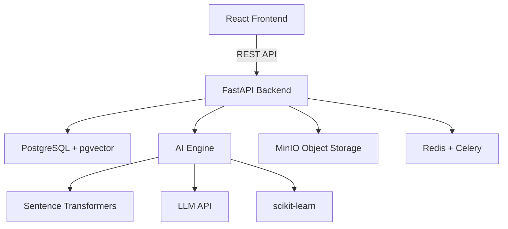

# SIH26136 — AI-Powered Government Innovation Procurement Platform

> **Smart India Hackathon 2026 | Problem Statement SIH26136**
>
> A startup-friendly public procurement mechanism that enables government departments to identify, pilot, procure, and scale innovative solutions from eligible startups.

---

## Overview

This platform replaces traditional government procurement workflows with an AI-assisted innovation procurement lifecycle:

```
PROBLEM → UNDERSTAND → MATCH → EVALUATE → PILOT → MEASURE → VALIDATE → SCALE
```

The core differentiator is an **AI Innovation Matchmaker** that semantically understands government problems and matches them against startup capabilities — not through keyword matching, but through deep understanding of domains, technologies, outcomes, and constraints.

All AI outputs are explainable and auditable. Final decisions always rest with human government officers (Human-in-the-Loop architecture).

---

## Architecture



---

## Tech Stack

| Layer | Technology |
|---|---|
| Frontend | React, TypeScript, Vite, Tailwind CSS, shadcn/ui, Recharts |
| Backend | Python, FastAPI, Pydantic, SQLAlchemy 2.x, Alembic |
| Database | PostgreSQL + pgvector |
| AI/ML | Sentence Transformers, scikit-learn, LLM API |
| Storage | MinIO (S3-compatible) |
| Background | Redis, Celery |
| Auth | JWT, Argon2, RBAC |
| Deploy | Docker, Docker Compose |

---

## User Roles

| Role | Description |
|---|---|
| **Government Officer** | Creates challenges, reviews proposals, manages pilots, makes procurement decisions |
| **Startup** | Discovers challenges, submits proposals, executes pilots |
| **Evaluator** | Independently evaluates proposals and validates pilot outcomes |
| **Admin / Auditor** | Manages users, departments, and reviews audit trails |

---

## Project Structure

```
sih26136/
├── frontend/          ← React + TypeScript + Vite
│   └── src/
│       ├── components/  (reusable UI + layout)
│       ├── pages/       (role-grouped page shells)
│       ├── hooks/       (custom React hooks)
│       ├── services/    (API client)
│       ├── types/       (TypeScript definitions)
│       ├── context/     (React contexts)
│       ├── data/        (navigation config, demo data)
│       └── utils/       (utility functions)
│
├── backend/           ← Python + FastAPI
│   └── app/
│       ├── api/         (route handlers)
│       ├── models/      (SQLAlchemy models)
│       ├── schemas/     (Pydantic schemas)
│       ├── services/    (business logic)
│       ├── repositories/ (database access)
│       ├── ai/          (AI engine)
│       ├── core/        (config, security, database)
│       └── utils/       (helpers)
│
├── data/              ← seed data, sample proposals
├── docs/              ← documentation
├── docker-compose.yml
├── .env.example
└── README.md
```

---

## Quick Start

### Prerequisites

- Node.js 18+
- Python 3.11+
- Docker & Docker Compose (for full stack)

### Frontend Only (Development)

```bash
cd frontend
npm install
npm run dev
```

Open [http://localhost:5173](http://localhost:5173)

### Backend Only (Development)

```bash
cd backend
python -m venv venv
source venv/bin/activate  # Windows: venv\Scripts\activate
pip install -r requirements.txt
uvicorn app.main:app --reload --port 8000
```

### Full Stack (Docker)

```bash
cp .env.example .env
# Edit .env with your values
docker compose up
```

---

## License

Built for Smart India Hackathon 2026. All rights reserved.
